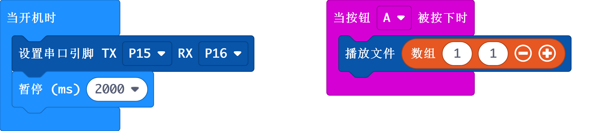

# 心点科技语音模块

makcode扩展库  

Author: lz

Date:   2020.Mar  

  
  

## 添加扩展

在makecode编程界面，选择扩展，粘贴以下地址：

https://github.com/zl05101/pxt-XD_Voice

点击添加即可

## 基本用法

```
input.onButtonPressed(Button.A, function () {
    XD_Voice.play([1, 1])
})
XD_Voice.begin(SerialPin.P15, SerialPin.P16)
```

## API接口

- **begin(tx:SerialPin, rx:SerialPin)**  
语音模块用串口通讯，此接口设置串口引脚
  - tx: 串口TX引脚
  - rx: 串口RX引脚

- **play(list:number[])**  
播放语音文件
  - list: 要播放的文件，参数类型为数组。第一个元素为文件夹名字，第二个元素是此文件夹下的文件名，可以组合播报多个文件。
比如数组为[1,1]表示播放01文件夹下文件名为01的语音文件，[1,1,1,2,2,3]表示组合播放文件夹01底下01文件、01文件夹下02文件、02文件夹下03文件。

  - 注意：数组元素的个数一定是偶数个，如果设置是奇数个则无法播报。

- **volumeSet(vol:number)**  
设置音量

  - vol: 音量值，范围:0-30

- **reset()**  
复位

- **busy()**  
判断是不是在播报中，返回true则表示在播报，false表示空闲。

## Demo

  


## License

MIT

Copyright (c) 2018, microbit/micropython Chinese community  

## 支持类型

* for PXT/microbit


[From microbit/micropython Chinese community](http://www.micropython.org.cn)
